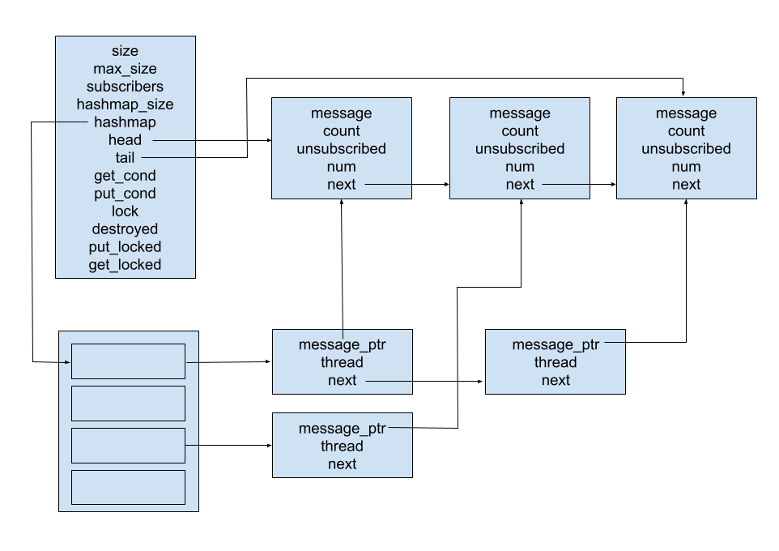

# Multi-thread publish-subscribe queue

The project implements a mutex-potected publish-subscribe queue with a given maximum size. Any thread can subscribe to the queue to be able to read new messages. Threads can also add new messages and perform basic operations on the queue.

## Implementation

The main ```TQueue``` structure contains maximum (```max_size```) and current size (```size```) of the queue, total subscribers (```subscribers```) (not counting unsubscriptions, it is reset together with ```unsubsribed``` on messages when number of subscribers exceeds 0x40000000), size of the hashmap used to store thread information (```hashmap_size```) as well as pointers to the hashmap (```hashmap```), head of the queue (```head```) and tail of the queue (```tail```). One mutex (```lock```) is used to guard access to the queue, while two condition variables are used to manage threads waiting for get and put operations (```get_cond```, ```put_cond```). To facilitate queue destruction a flag ```destroyed``` and counters for number of threads waiting on each condition variable are used (```get_locked```, ```put_locked```).

The messages queue is implemented using linked lists with ```Tqueue``` structure storing pointers to its head, tail, its current and maximum size. Each node of the list (```TqueueMessage```) stores message ```msg``` (a void pointer), a number of subscribers that still need to read the message ```count```, the number of threads that unsubscribed while this message was their next to read ```unsubscribed``` (propagates to the next message once the messages is removed from the queue) and a pointer to the next message ```next```. The last (newest) element of the message queue is a dummy node. Once a new message is added, the dummy node is changed to a message node and a new dummy node is created. 

Information about threads is stored in a hashmap using FNV hash function and chaining. Its default size is 16. This information includes pointer to the next message to read ```message_ptr```, thread identifier of the thread ```thread``` and pointer to the next thread information node ```next```, all stored on a ```TQueueThread``` node.

The structure of the ```Tqueue```, linked list and hashmap is shown in the picture below:



If a subsciber attempts to read a message while no messages are available, it gets locked on a conditional variable ```get_cond``` and a variable ```get_locked``` is incremented until the thread leaves the condition variable. Similarly if a publisher attempts to add a message while the queue is full, it gets  locked on a conditional variable ```put_cond``` and a variable ```put_locked``` is incremented until the thread leaves the condition variable. These locked threads counters are used to ensure no threads are waiting on condition variables when the queue gets destroyed as this would lead to undefined behaviour.

It is possible to destroy the queue in two steps. In the first step most of the queue except for the mutex is destroyed and a ```destroyed``` flag is set allowing threads to gain information about the destruction. This allows for ending the threads after first step of the destruction, joining them and continuing to destroy the mutex in the second step once it is known that no more threads will attempt to access the queue. If the user wishes to manually manage the threads, both steps can be carried out with a single function too.

## Interface functions

The available operations are as following (the prefix ```TQueue``` is used to avoid naming conflicts):

```void TQueueCreateQueue(TQueue * queue, int *size)``` - creates a queue with given size for messages and default hashmap size for subscribers

```void TQueueCreateQueue(TQueue * queue, int *size, int *hashmap_size)``` - creates a queue with given size for messages and given hashmap size for subscribers

```int TQueueDestroyQueue(TQueue * queue)``` - destroys queue, if the user cannot guarantee that no new operations will be performed on the queue it is advised to use functions ```TQueueDestroyQueue_1(TQueue *queue)``` and ```TQueueDestroyQueue_2(TQueue *queue)```; returns 0 on sucess, -1 if the queue has already been destroyed*

```int TQueueDestroyQueue_1(TQueue * queue)``` - destroys all of the queue except for the mutex and sets destroy variable to 1; this causes all operations acessing the queue to fail and return information that the queue has been destroyed which can be used for synchronization as shown in example file ```example.c```; returns 0 on sucess, -1 if the queue has already been destroyed*

```void TQueueDestroyQueue_2(TQueue * queue)``` - destroys the mutex, trying to access the queue afterwards will result in undefined behaviour

```int TQueueSubscribe(TQueue * queue, pthread_t * thread)``` - adds thread ```thread``` as subscriber, the thread will be able to read messages added after this operation; returns 0 on sucess, -1 if the queue has already been destroyed*, 1 if the thread is already subscribed

```int TQueueUnsubscribe(TQueue * queue, pthread_t * thread)``` - removes thread ```thread``` as subscriber, all its unread messages will be treated as if they were read; returns 0 on sucess, -1 if the queue has already been destroyed*, 1 if the thread is not subscribed

```int TQueuePut(TQueue * queue, void *msg)``` - adds message ```msg``` to the queue, this operation is blocking if the queue is full; returns 0 on sucess, -1 if the queue has already been destroyed*

```void *TQueueGet(TQueue * queue, pthread_t * thread)``` - reads and returns a single message from the queue, if no messages are available the operation is blocking, if the thread is not subscribed or queue has been destroyed* it returns NULL, if all subscribers who have been subscribed at the time of message publication have read the message, the message is removed from the queue

```int TQueueGetAvailable(TQueue * queue, pthread_t * thread)``` - returns the number of messages available to the thread ```thread```; returns -1 if the queue has already been destroyed*, -2 if the thread is not subscribed

```int TQueueRemoveMsg(TQueue * queue, void *msg)``` - removes message ```msg``` from the queue, if the same message is duplicated on the queue, this function will remove the oldest instance; returns 0 on sucess, -1 if the queue has already been destroyed*, -2 if the message is not present in the queue

```int TQueueSetSize(TQueue * queue, int *size)``` - sets maximum size of the queue to ```size```, if the new size exceeds the former one, the oldest messages are removed; returns 0 on sucess, -1 if the queue has already been destroyed*

```int TQueueSetHashmapSize(TQueue * queue, int *hashmap_size)``` - sets hashmap size for subscribers to ```hashmap_size```; returns 0 on sucess, -1 if the queue has already been destroyed*

\* - applies to the first step with ```destroyed``` flag set to 1 but mutex still remaining

## Files

The project contains following files:

```tqueue.h``` - definitions for the publish-subscribe queue

```tqueue.c``` - implementations for the publish-subscribe queue

```example.c``` - example of use of the publish-subscribe queue

## Compilation

An executable showcasing how the queue works can be compiled to ```example``` file using following command:

```sh
gcc -Wall -lpthread tqueue.c example.c -o example
```

if the ```queue.c``` file is compiled with DEBUG macro it will print all operations on the queue and state of the queue before and after each operation to stdout:

```sh
gcc -Wall -lpthread -DDEBUG tqueue.c example.c -o example
```

It is also possible to use ```tqueue.c``` and ```tqueue.h``` files in other projects. To do so, the header file must be included in the project file and the project files must be compiled with the ```tqueue.c``` file.

```c
#include "tqueue.h"
```
```sh
gcc -Wall -lpthread tqueue.c [other c files] -o [executable name]
```

